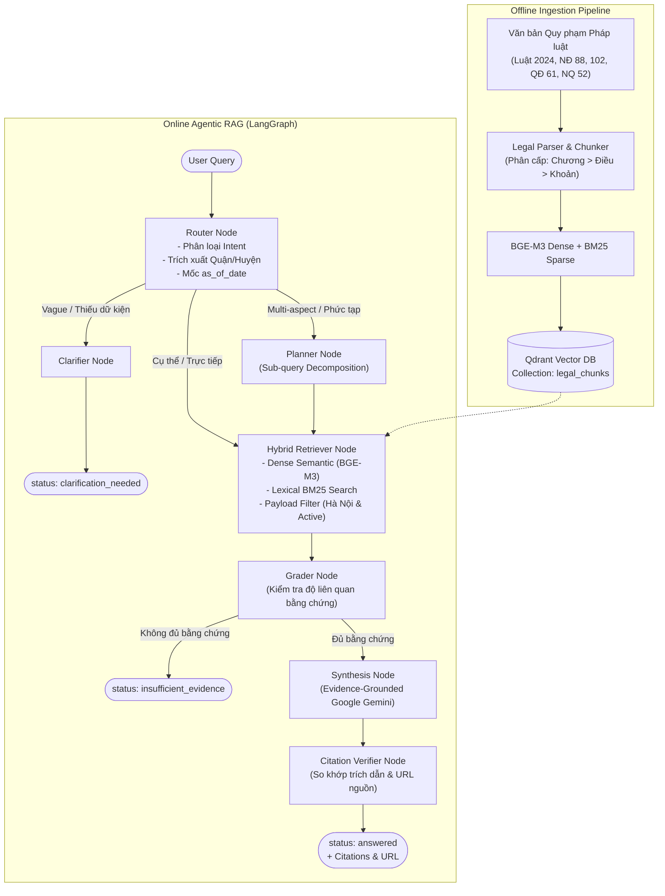
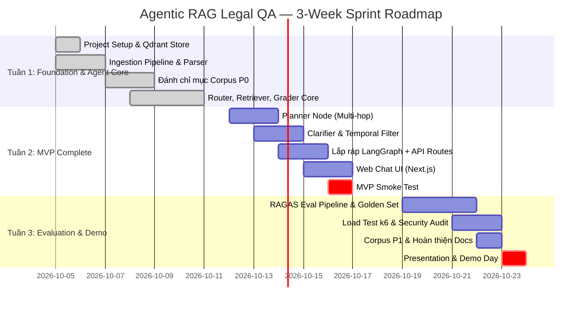

# 🏛️ Agentic RAG Legal QA — Hà Nội

[](https://www.python.org/)
[](https://fastapi.tiangolo.com/)
[](https://langchain-ai.github.io/langgraph/)
[](https://qdrant.tech/)
[](https://github.com/astral-sh/ruff)
[](tests/)

> **Hệ thống hỏi đáp thông minh văn bản quy phạm pháp luật về đất đai, quy hoạch, thu hồi đất, bồi thường và tái định cư tại Thành phố Hà Nội**  
> *Được xây dựng trên kiến trúc **Agentic RAG** (LangGraph + FastAPI + Qdrant Vector Store + BGE-M3 Dense Embedding + BM25 Lexical Hybrid Search)*

---

## 📖 Mục lục

1. [Bối cảnh & Động lực dự án](#-bối-cảnh--động-lực-dự-án)
2. [Đề xuất Giá trị & Nguyên tắc Cốt lõi](#-đề-xuất-giá-trị--nguyên-tắc-cốt-lõi)
3. [Kiến trúc Kỹ thuật (Agentic RAG Architecture)](#-kiến-trúc-kỹ-thuật-agentic-rag-architecture)
4. [Giao diện & Trải nghiệm Người dùng (UI Flow)](#-giao-diện--trải-nghiệm-người-dùng-ui-flow)
5. [Cơ sở Dữ liệu Pháp lý (Corpus Tiers)](#-cơ-sở-dữ-liệu-pháp-lý-corpus-tiers)
6. [Đặc tả Giao tiếp API (API Contract)](#-đặc-tả-giao-tiếp-api-api-contract)
7. [Lộ trình Phát triển 3 Tuần (Sprint Roadmap)](#-lộ-trình-phát-triển-3-tuần-sprint-roadmap)
8. [Hướng dẫn Cài đặt & Khởi chạy](#-hướng-dẫn-cài-đặt--khởi-chạy)
9. [Kiểm thử & Đánh giá Chất lượng](#-kiểm-thử--đánh-giá-chất-lượng)
10. [Tuyên bố Miễn trừ Trách nhiệm (Legal Disclaimer)](#-tuyên-bố-miễn-trừ-trách-nhiệm-legal-disclaimer)

---

## 🎯 Bối cảnh & Động lực dự án

Thành phố Hà Nội đang trong giai đoạn triển khai quy hoạch đồng loạt các đại dự án hạ tầng trọng điểm:
- **Đường Vành đai 4 — Vùng Thủ đô** đi qua 7 quận, huyện.
- Mạng lưới **Đường sắt đô thị (Metro)** và các khu đô thị mới ven sông Hồng, phía Tây, phía Bắc Thủ đô.
- Điều chỉnh địa giới và mở rộng quy hoạch phát triển đô thị.

Hàng trăm nghìn hộ dân, chuyên gia pháp lý và cán bộ hành chính đối mặt với các khó khăn tra cứu:
1. **Luật Đất đai số 31/2024/QH15** thay thế toàn diện Luật 2013 với nhiều cơ chế bồi thường, tái định cư và bảng giá đất hoàn toàn mới.
2. Văn bản quy định phân tán giữa cấp Trung ương (Chính phủ, Bộ TN&MT) và chính sách đặc thù của TP. Hà Nội (HĐND, UBND TP).
3. **Rủi ro áp dụng văn bản hết hiệu lực** hoặc diễn giải sai lệch thẩm quyền giữa các cấp.
4. **Ảo giác của AI (Hallucination)**: Các mô hình LLM thông thường có nguy cơ bịa đặt số hiệu điều khoản nếu không có ràng buộc trích dẫn bằng chứng nghiêm ngặt.

---

## 💡 Đề xuất Giá trị & Nguyên tắc Cốt lõi

| Đối tượng | Giá trị mang lại |
|---|---|
| **Người dân** | **Hiểu quyền lợi bồi thường trong 60 giây** thay vì mất hàng giờ tự đọc văn bản; nắm rõ diện tích tái định cư và giá đất áp dụng. |
| **Luật sư & Chuyên gia** | Tiết kiệm **30–60 phút/vụ việc** tra cứu đối chiếu; xuất trích dẫn chính xác cấp Điều/Khoản kèm đường dẫn văn bản gốc. |
| **Cán bộ Hành chính** | Giải đáp thắc mắc của công dân chuẩn xác, minh bạch; có kiểm tra mốc thời gian hiệu lực (`as_of_date`) và audit trail. |

### 4 Nguyên tắc An toàn Pháp lý (Core Principles)

1. **Evidence-First & Traceable Citations**: Mọi câu trả lời bắt buộc phải có trích dẫn chính xác: tên văn bản, số hiệu, điều, khoản, điểm, đường dẫn cổng VBPL chính thức và đoạn trích dẫn nguyên văn (`quote`).
2. **Temporal Validity Management (`as_of_date`)**: Tự động kiểm tra trạng thái hiệu lực (`active`, `superseded`, `amended`) tại thời điểm người dùng truy vấn. Tuyệt đối không viện dẫn văn bản đã hết hiệu lực.
3. **Chủ động Từ chối (`insufficient_evidence`)**: Khi corpus không có đủ căn cứ pháp lý tin cậy, hệ thống từ chối trả lời và khuyến nghị tham vấn luật sư, không bao giờ phỏng đoán.
4. **Chủ động Hỏi lại (`clarification_needed`)**: Khi câu hỏi thiếu các dữ kiện then chốt (như quận/huyện cụ thể tại Hà Nội, loại đất nông nghiệp hay đất ở), hệ thống yêu cầu người dùng làm rõ trước khi tra cứu.

---

## 🏗️ Kiến trúc Kỹ thuật (Agentic RAG Architecture)

Hệ thống ứng dụng kiến trúc **Agentic RAG** điều phối qua **LangGraph**:



### Các Node điều phối trong LangGraph:
- **`router_node`**: Phân loại đường đi (`single_hop`, `multi_hop`, `clarification`), nhận diện 30 quận/huyện Hà Nội và thời điểm áp dụng `as_of_date`.
- **`planner_node`**: Tách câu hỏi đa bước (so sánh quy định Trung ương vs Hà Nội) thành các sub-queries độc lập.
- **`retrieval_node`**: Thực thi tìm kiếm lai (Dense 1024-dim BGE-M3 + BM25 Sparse), kết hợp RRF (Reciprocal Rank Fusion) và bộ lọc payload nghiêm ngặt.
- **`grader_node`**: Chấm điểm độ liên quan của các đoạn tài liệu truy xuất, loại bỏ dữ liệu nhiễu.
- **`synthesize_node`**: Sinh câu trả lời bám sát bằng chứng, tạo danh sách trích dẫn chuẩn pháp lý.
- **`verify_node`**: Hậu kiểm trích dẫn, xác nhận tính xác thực của điều khoản và URL trước khi trả về.
- **`clarification_node`**: Đặt câu hỏi định hướng khi người dùng cung cấp thiếu dữ kiện.

---

## 🖥️ Giao diện & Trải nghiệm Người dùng (UI Flow)

Được thiết kế dựa trên đặc tả kỹ thuật chi tiết tại [docs/Wireframe_UI_Flow.md](docs/Wireframe_UI_Flow.md):

### 1. Sitemap & Cấu trúc màn hình
- **Trang chủ (`/`)**: Giới thiệu giải pháp, danh mục chủ đề tra cứu nhanh, thanh tìm kiếm thông minh.
- **Giao diện Chat (`/chat`)**: Khung hội thoại tương tác, thanh lọc mốc thời gian `as_of_date` và quận/huyện, hiển thị trích dẫn tương tác, cây suy luận (Reasoning Trace).
- **Trình duyệt Văn bản (`/documents`)**: Danh mục 30+ văn bản pháp luật, phân loại theo cấp ban hành và hiệu lực.
- **Admin Dashboard (`/admin`)**: Quản lý phiên bản corpus, theo dõi telemetry độ trễ và tỷ lệ đánh giá người dùng.

### 2. Design System Tokens
- **Bảng màu**: Deep Navy (`#1B4F72` - Tin cậy, pháp lý), Accent Orange (`#E67E22` - Điểm nhấn CTA), Success Green (`#27AE60`), Warning Yellow (`#F39C12`), Error Red (`#E74C3C`).
- **Thẻ Trích dẫn (Citation Card)**: Hiển thị nổi bật số hiệu văn bản, điều khoản, trích đoạn nguyên văn và liên kết mở trực tiếp văn bản gốc trên Cổng VBPL.

---

## 📚 Cơ sở Dữ liệu Pháp lý (Corpus Tiers)

Toàn bộ văn bản được phân đoạn theo đơn vị **Khoản / Điều** kèm ngữ cảnh breadcrumb và metadata chuẩn:

| Tier | Nhóm Văn bản | Các Văn bản Tiêu biểu |
|---|---|---|
| **P0 (Hạt nhân)** | Luật & Nghị định bắt buộc + Quy định Hà Nội | • Luật Đất đai số 31/2024/QH15<br>• Nghị định số 88/2024/NĐ-CP (Bồi thường, hỗ trợ, tái định cư)<br>• Nghị định số 102/2024/NĐ-CP (Chi tiết thi hành Luật Đất đai)<br>• Quyết định 61/2024/QĐ-UBND TP. Hà Nội<br>• Nghị quyết 52/2025/NQ-HĐND TP. Hà Nội (Bảng giá đất) |
| **P1 (Mở rộng)** | Nghị định & Thông tư bổ trợ | • Nghị định 71/2024/NĐ-CP (Giá đất)<br>• Nghị định 101/2024/NĐ-CP (Cấp sổ đỏ, đo đạc)<br>• Thông tư 10/2024/TT-BTNMT |
| **P2 (Chuyên sâu)** | Hướng dẫn & Án lệ | • Văn bản giải đáp vướng mắc của Cục Quy hoạch & Phát triển Tài nguyên đất<br>• Án lệ tranh chấp đất đai tại Hà Nội |

---

## 🔌 Đặc tả Giao tiếp API (API Contract)

### 1. `POST /api/v1/query` — Tra cứu Pháp luật

**Request Body:**
```json
{
  "query": "Hạn mức giao đất ở tại quận Cầu Giấy theo quy định mới nhất của Hà Nội là bao nhiêu?",
  "as_of_date": "2026-10-04",
  "district": "Cầu Giấy",
  "max_results": 5,
  "include_reasoning_steps": true
}
```

**Response (200 OK — Trả lời thành công):**
```json
{
  "query": "Hạn mức giao đất ở tại quận Cầu Giấy...",
  "status": "answered",
  "answer": "Căn cứ Quyết định 61/2024/QĐ-UBND của UBND TP. Hà Nội, hạn mức giao đất ở mới cho cá nhân tại các phường thuộc quận Cầu Giấy được quy định...",
  "citations": [
    {
      "doc_id": "61-2024-QD-UBND",
      "document_title": "Quyết định 61/2024/QĐ-UBND của UBND TP. Hà Nội",
      "document_number": "61/2024/QĐ-UBND",
      "article_ref": "Điều 14",
      "clause": "Khoản 1",
      "snippet": "Hạn mức giao đất ở cho cá nhân tại các phường thuộc các quận...",
      "source_url": "https://congbao.hanoi.gov.vn/...",
      "effective_date": "2024-10-07",
      "relevance_score": 0.94
    }
  ],
  "reasoning_steps": [
    "Router: Phân loại single_hop, địa bàn Cầu Giấy",
    "Retriever: Lấy 5 chunks từ Qdrant với bộ lọc Hà Nội",
    "Grader: 4/5 chunks đạt ngưỡng liên quan",
    "Synthesis: Tổng hợp có trích dẫn từ Điều 14 QĐ 61/2024"
  ],
  "route": "single_hop",
  "sub_queries": [],
  "processing_time_ms": 3250.5,
  "as_of_date_applied": "2026-10-04"
}
```

**Response (200 OK — Cần làm rõ):**
```json
{
  "query": "giá bồi thường đất",
  "status": "clarification_needed",
  "answer": null,
  "clarification_question": "Câu hỏi của bạn chưa đủ thông tin cụ thể (ví dụ: loại đất nông nghiệp hay đất ở, địa bàn quận/huyện cụ thể tại Hà Nội). Vui lòng bổ sung để hệ thống tra cứu chính xác.",
  "citations": []
}
```

### 2. `GET /api/v1/health` — Kiểm tra Trạng thái Hệ thống
```json
{
  "status": "healthy",
  "version": "1.0.0",
  "qdrant": "connected",
  "llm": "connected",
  "corpus_size": 1250
}
```

### 3. `POST /api/v1/feedback` — Gửi Phản hồi Người dùng
```json
{
  "query_id": "b4a2a8c5-7121-408c-bd9b-aeb5cc5663f7",
  "rating": "positive",
  "comment": "Trích dẫn chính xác, đối chiếu được ngay văn bản gốc."
}
```

---

## 📅 Lộ trình Phát triển 3 Tuần (Sprint Roadmap)

> **Tổng thời gian: 3 tuần | MVP hoàn thiện: Cuối Tuần 2**



---

## 🚀 Hướng dẫn Cài đặt & Khởi chạy

### 1. Yêu cầu Tiên quyết
- **Python**: 3.11+
- **Docker & Docker Compose** (cho Qdrant vector database)

### 2. Cài đặt Môi trường
```bash
# Clone repository
git clone git@github.com:dovh25/agentic-rag-legal-qa-hanoi.git
cd agentic-rag-legal-qa-hanoi

# Tạo môi trường ảo
python3 -m venv .venv
source .venv/bin/activate

# Cài đặt thư viện phụ thuộc
pip install -r requirements.txt

# Cấu hình biến môi trường
cp .env.example .env
# Cập nhật OPENAI_API_KEY hoặc Qdrant URL trong file .env nếu cần
```

### 3. Khởi chạy Ứng dụng

**Cách 1: Khởi động Server Phát triển (Local Dev)**
```bash
# Khởi chạy server FastAPI với live-reload
make dev
```
Truy cập tài liệu API:
- **Swagger UI**: [http://localhost:8000/docs](http://localhost:8000/docs)
- **ReDoc**: [http://localhost:8000/redoc](http://localhost:8000/redoc)

**Cách 2: Khởi chạy bằng Docker Compose (Bao gồm Qdrant)**
```bash
# Khởi động dịch vụ Qdrant Vector Store & API
make docker-up

# Kiểm tra log dịch vụ
docker compose logs -f

# Dừng dịch vụ
make docker-down
```

---

## 🧪 Kiểm thử & Đánh giá Chất lượng

Dự án áp dụng quy trình kiểm chuẩn tự động nghiêm ngặt:

```bash
# Chạy toàn bộ test suite (Unit, Integration, Agent Flow)
make test

# Kiểm tra lỗi style và format mã nguồn với Ruff
make lint
make format

# Chạy kịch bản đánh giá Benchmark trên tập câu hỏi kiểm thử
make eval
```

### Tiêu chí Chất lượng Nghiệm thu (KPIs):
- **Retrieval Recall@5**: $\ge 90\%$ trên tập câu hỏi pháp luật P0.
- **Citation Accuracy**: $\ge 95\%$ trích dẫn đúng điều khoản quy định.
- **Faithfulness Score**: $\ge 0.90$ theo chuẩn đánh giá RAGAS.
- **P95 Latency**: $\le 8.0$ giây đối với câu hỏi đơn bước (Single-hop).
- **Tỷ lệ Ảo giác (Hallucination)**: $\le 1.0\%$.

---

## ⚖️ Tuyên bố Miễn trừ Trách nhiệm (Legal Disclaimer)

> **LƯU Ý QUAN TRỌNG:**  
> Hệ thống **Agentic RAG Legal QA — Hà Nội** là công cụ ứng dụng trí tuệ nhân tạo nhằm **hỗ trợ tra cứu, tổng hợp và định vị thông tin văn bản quy phạm pháp luật**.  
> Thông tin do hệ thống cung cấp **KHÔNG THAY THẾ** ý kiến tư vấn pháp lý chính thức của Luật sư, Tổ chức hành nghề luật hoặc quyết định có giá trị pháp lý của cơ quan Nhà nước có thẩm quyền.  
> Người dùng cần đối chiếu với văn bản gốc có hiệu lực thi hành tại thời điểm áp dụng trước khi đưa ra các quyết định pháp lý liên quan.

---

*Tài liệu kỹ thuật được duy trì bởi nhóm dự án. Chi tiết tham khảo: [PRD.md](docs/PRD.md) · [Brief.md](docs/Brief.md) · [Wireframe_UI_Flow.md](docs/Wireframe_UI_Flow.md).*
