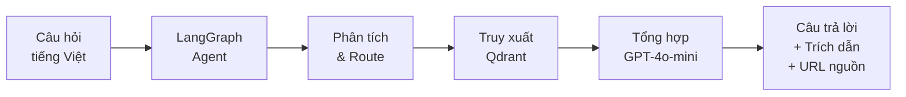
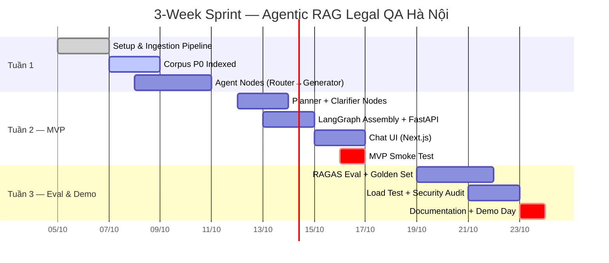

# Project Brief
# Agentic RAG Legal QA — Hà Nội

> **Loại tài liệu**: Project Brief (Tóm tắt dự án chiến lược)
> **Phiên bản**: v1.1 | **Ngày**: 2026-10-04 | **Tác giả**: Vũ Huy Đô

---

## Tóm tắt 1 dòng

> Hệ thống hỏi đáp pháp luật đất đai thông minh cho Hà Nội — trả lời chính xác, có trích dẫn, không hallucinate.

---

## Vấn đề (Problem)

Hà Nội đang quy hoạch lại hàng trăm vị trí (Vành đai 4, đường sắt đô thị, các khu đô thị mới...), khiến hàng trăm nghìn hộ dân và hàng nghìn cán bộ, chuyên gia pháp lý cần tra cứu khẩn cấp các quy định về:

- **Bồi thường đất** khi bị thu hồi
- **Tái định cư** — điều kiện, diện tích, vị trí
- **Quy hoạch sử dụng đất** — loại đất, mục đích, thời hạn
- **Thủ tục hành chính** liên quan

**Khó khăn cốt lõi:**
1. Văn bản pháp luật thay đổi nhanh (Luật Đất đai 2024 thay toàn bộ Luật 2013)
2. Phân tán trên nhiều nguồn (VBPL, UBND, Bộ TN&MT...)
3. Ngôn ngữ pháp lý phức tạp, khó hiểu với người dân thường
4. Rủi ro áp dụng văn bản đã hết hiệu lực

---

## Giải pháp (Solution)

**Agentic RAG** — câu hỏi tiếng Việt tự nhiên → LangGraph Agent phân tích, truy xuất, tổng hợp → câu trả lời + trích dẫn điều khoản + URL nguồn.

**Khác biệt cốt lõi so với search engine thông thường:**

| Search Engine | Agentic RAG System |
|---|---|
| Trả về danh sách link | Trả lời câu hỏi trực tiếp |
| Người dùng tự đọc & tổng hợp | Hệ thống tổng hợp có trích dẫn |
| Không biết văn bản nào còn hiệu lực | Lọc theo `as_of_date` tự động |
| Có thể trả về kết quả lỗi thời | Kiểm tra metadata hiệu lực |
| Không phân biệt đơn giản vs phức tạp | Router: single-hop / multi-hop |

---

## Đề xuất Giá trị (Value Proposition)

### Với người dân
- **"Hiểu quyền lợi của mình trong 60 giây"** thay vì 3 giờ đọc văn bản
- Câu trả lời ngôn ngữ bình dân, có ví dụ cụ thể
- Có thể kiểm chứng ngay điều khoản được trích dẫn

### Với luật sư / chuyên gia
- **Tiết kiệm 30–60 phút/vụ** tìm kiếm và đối chiếu văn bản
- Lấy trích dẫn chính xác cho báo cáo, hồ sơ
- API có thể tích hợp vào workflow sẵn có

### Với cán bộ hành chính
- **Trả lời thắc mắc công dân nhanh, chính xác**
- Luôn dùng văn bản còn hiệu lực tại thời điểm xử lý
- Audit trail: mọi câu trả lời đều có reasoning steps

---

## Chỉ số Thành công (Success Metrics)

| Metric | Baseline (hiện tại) | Target (MVP) |
|---|---|---|
| Thời gian tra cứu trung bình | 15–30 phút | < 60 giây |
| Faithfulness score (RAGAS) | N/A | >= 0.90 |
| Citation accuracy | N/A | >= 95% |
| Tỉ lệ hallucination | N/A (không kiểm soát) | <= 1% |
| API P95 latency | N/A | <= 8s (single-hop) |
| SUS Score (UX) | N/A | >= 75/100 |

---

## Tech Stack Snapshot

| Layer | Công nghệ |
|---|---|
| **Agent Orchestration** | LangGraph 0.2+ |
| **LLM** | Google Gemini (gemini-3.8-flash qua OpenAI-compatible endpoint) |
| **Embedding** | BAAI/bge-m3 (1024 dims dense + BM25 sparse weights) |
| **Vector Store** | Qdrant (Qdrant Cloud / Docker local / collection: legal_chunks) |
| **Data Ingestion** | Automated Crawler & Parser (vanban.chinhphu.vn, congbao.hanoi.gov.vn) |
| **API** | FastAPI + Uvicorn |
| **Data Validation** | Pydantic v2 |
| **Logging** | Loguru (JSON structured) |
| **Containerization** | Docker + Docker Compose |
| **Eval** | RAGAS + custom golden set |
| **CI** | Ruff (lint/format) + pytest |

---

## Giả định & Phụ thuộc (Assumptions & Dependencies)

### Giả định
- Văn bản P0 sẵn có trên Cổng thông tin Chính phủ và Công báo Hà Nội, cho phép crawl và parse tự động.
- Gemini API key (Google AI Studio Free Tier) được cung cấp và cấu hình trong `.env`.
- Qdrant có thể chạy local via Docker trong môi trường phát triển
- Người dùng có kết nối internet ổn định để sử dụng web UI

### Rủi ro cần theo dõi
- Chất lượng OCR của văn bản PDF scan → ảnh hưởng retrieval recall
- Thay đổi chính sách OpenAI (pricing, rate limit, model deprecation)
- Văn bản pháp luật mới ban hành chưa có trong corpus → cần quy trình cập nhật

---

## Phạm vi MVP (What's In / Out)

### IN ✅
- Chat Q&A tiếng Việt tự nhiên
- Agentic routing: single-hop / multi-hop / clarification
- Metadata filter: `as_of_date`, `district`, `document_type`
- Citation với link nguồn VBPL
- REST API + Swagger docs
- Corpus 30+ văn bản pháp luật đất đai (P0 + P1)

### OUT ❌
- Voice input/output
- Dự đoán giá bồi thường cụ thể
- Tích hợp bản đồ GIS
- Hệ thống tài khoản / đăng nhập
- Đa ngôn ngữ

---

## Timeline — 3 Tuần Sprint

| Milestone | Ngày mục tiêu | Deliverable |
|---|---|---|
| **M1** | Cuối Tuần 1 | Ingestion pipeline + corpus P0 + agent nodes cơ bản |
| **M2 — MVP** | Cuối Tuần 2 | Full agent + FastAPI + Chat UI — demo được |
| **M3 — Done** | Cuối Tuần 3 | Eval pass + documentation + Demo Day |

---

## Go / No-Go Criteria

### GO nếu (cuối Tuần 2):
- [x] Faithfulness >= 0.90 trên eval set
- [x] P95 latency <= 8s (single-hop)
- [x] 0 critical security vulnerabilities
- [x] Corpus P0 đầy đủ và index thành công
- [x] Demo UI hoạt động ổn định

### NO-GO nếu:
- [ ] Hallucination rate > 5% trong manual audit
- [ ] Corpus chất lượng quá thấp (OCR error rate > 20%)
- [ ] OpenAI API không khả dụng hoặc chi phí vượt ngân sách

---

## Bên liên quan (Stakeholders)

| Vai trò | Người | Trách nhiệm |
|---|---|---|
| Developer / Owner | Vũ Huy Đô | Toàn bộ implementation, tài liệu |
| Advisor | ThS. Nguyễn Văn Sơn | Hướng dẫn học thuật, review |
| End User (Pilot) | 10 người dùng thử | Feedback UX, câu hỏi thực tế |

---

*Brief v1.1 — Xem PRD.md để biết chi tiết đầy đủ.*
