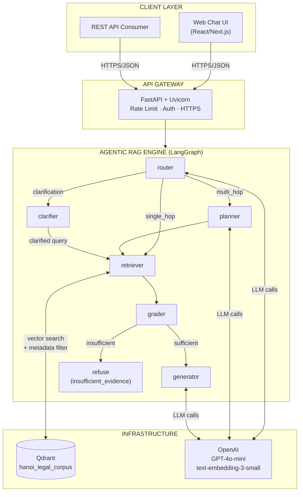
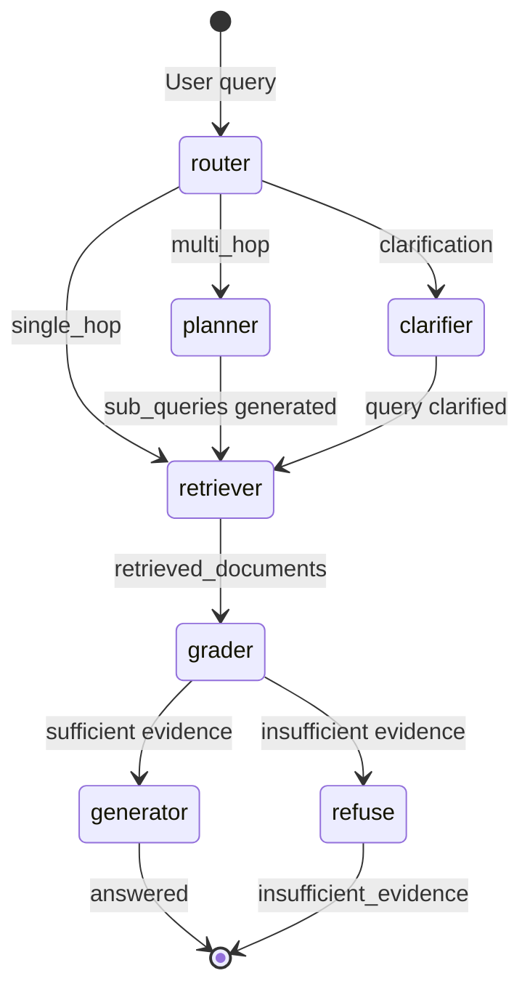
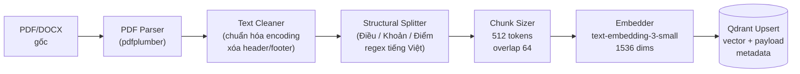
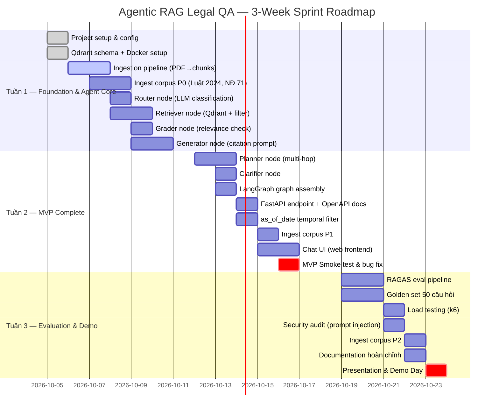

# Product Requirements Document (PRD)
# Agentic RAG Legal QA — Hà Nội

| Thuộc tính | Giá trị |
|---|---|
| **Phiên bản** | v1.1.0 |
| **Ngày tạo** | 2026-10-04 |
| **Tác giả** | Vũ Huy Đô |
| **Trạng thái** | Draft → Review |
| **Phân loại** | Confidential – Internal |

---

## Mục lục

1. [Executive Summary](#1-executive-summary)
2. [Bối cảnh & Vấn đề nghiệp vụ](#2-bối-cảnh--vấn-đề-nghiệp-vụ)
3. [Mục tiêu sản phẩm & OKRs](#3-mục-tiêu-sản-phẩm--okrs)
4. [Đối tượng người dùng (User Personas)](#4-đối-tượng-người-dùng-user-personas)
5. [Phạm vi & Giới hạn (Scope)](#5-phạm-vi--giới-hạn-scope)
6. [Yêu cầu chức năng (Functional Requirements)](#6-yêu-cầu-chức-năng-functional-requirements)
7. [Yêu cầu phi chức năng (Non-Functional Requirements)](#7-yêu-cầu-phi-chức-năng-non-functional-requirements)
8. [Kiến trúc hệ thống & Luồng xử lý Agent](#8-kiến-trúc-hệ-thống--luồng-xử-lý-agent)
9. [Data Model & Corpus Strategy](#9-data-model--corpus-strategy)
10. [API Contract](#10-api-contract)
11. [Acceptance Criteria & Definition of Done](#11-acceptance-criteria--definition-of-done)
12. [Rủi ro & Giảm thiểu](#12-rủi-ro--giảm-thiểu)
13. [Lộ trình phát triển (Roadmap)](#13-lộ-trình-phát-triển-roadmap)
14. [Dependencies & Constraints](#14-dependencies--constraints)
15. [Phụ lục](#15-phụ-lục)

---

## 1. Executive Summary

**Agentic RAG Legal QA – Hà Nội** là hệ thống hỏi đáp tiếng Việt thông minh, được xây dựng trên nền tảng **Retrieval-Augmented Generation (RAG)** kết hợp **LangGraph Agent**, chuyên phục vụ tra cứu văn bản quy phạm pháp luật về **đất đai, quy hoạch đô thị, thu hồi đất, bồi thường và tái định cư** trên địa bàn TP. Hà Nội.

Trong bối cảnh Hà Nội đang triển khai quy hoạch lại hàng trăm vị trí theo đồ án Quy hoạch Thủ đô đến 2050, nhu cầu tra cứu nhanh, chính xác và có trích dẫn pháp lý xác thực trở nên cấp bách với cả người dân lẫn các chuyên gia pháp lý, cán bộ hành chính.

Hệ thống **không thay thế tư vấn pháp lý** mà là công cụ tra cứu hỗ trợ quyết định, đảm bảo mọi câu trả lời đều:
- Có trích dẫn điều khoản pháp lý xác thực
- Kiểm soát hiệu lực theo thời điểm (`as_of_date`)
- Từ chối trả lời khi không đủ căn cứ (`insufficient_evidence`)

---

## 2. Bối cảnh & Vấn đề nghiệp vụ

### 2.1 Bối cảnh pháp lý – Hà Nội 2024–2030

| Sự kiện | Tác động |
|---|---|
| Luật Đất đai 2024 (hiệu lực 01/08/2024) | Thay thế Luật 45/2013, thay đổi toàn bộ cơ chế bồi thường, TĐC |
| Nghị định 71/2024/NĐ-CP | Hướng dẫn thi hành Luật Đất đai 2024 về bồi thường, TĐC |
| Nghị định 102/2024/NĐ-CP | Quy định chi tiết về quy hoạch sử dụng đất |
| Quy hoạch Thủ đô Hà Nội đến 2050 | Hơn 200 dự án quy hoạch, thu hồi đất quy mô lớn |
| Quyết định UBND TP về bảng giá đất (hàng năm) | Cơ sở tính bồi thường thay đổi theo từng giai đoạn |

### 2.2 Vấn đề hiện tại

**Người dân:**
- Không biết quyền và nghĩa vụ cụ thể khi bị thu hồi đất
- Không tiếp cận được văn bản pháp luật mới nhất
- Thông tin từ nhiều nguồn mâu thuẫn, dễ bị gây nhầm lẫn

**Chuyên gia / Cán bộ:**
- Mất nhiều thời gian tìm kiếm và đối chiếu văn bản qua nhiều cơ sở dữ liệu
- Rủi ro áp dụng văn bản đã hết hiệu lực
- Thiếu công cụ tổng hợp đa nguồn có kiểm chứng

### 2.3 Cơ hội thị trường

- Hơn **10 triệu dân** Hà Nội, trong đó ước tính ~500.000 hộ thuộc vùng quy hoạch giai đoạn 2024–2030
- Thị trường LegalTech Việt Nam còn sơ khai, chưa có sản phẩm RAG chuyên sâu lĩnh vực đất đai
- Mô hình có thể nhân rộng ra các tỉnh thành khác sau MVP

---

## 3. Mục tiêu sản phẩm & OKRs

### 3.1 Mục tiêu chiến lược

| Mục tiêu | Mô tả |
|---|---|
| **Độ chính xác pháp lý** | Mọi câu trả lời phải có trích dẫn điều khoản xác thực, không hallucinate |
| **Tốc độ tra cứu** | Giảm thời gian tìm kiếm văn bản từ 15–30 phút xuống dưới 60 giây |
| **Tin cậy & Minh bạch** | Người dùng có thể kiểm chứng nguồn trích dẫn trực tiếp |
| **An toàn thông tin** | Không lưu thông tin cá nhân nhạy cảm |

### 3.2 OKRs – 3 Tuần Sprint

**Objective 1: Xây dựng corpus chất lượng cao (Tuần 1)**
- KR1.1: Nạp >= 30 văn bản pháp luật gốc P0+P1 vào vector store
- KR1.2: Metadata đầy đủ: số hiệu, ngày ban hành, ngày hiệu lực, ngày hết hiệu lực
- KR1.3: Chunking strategy đạt recall@5 >= 0.85 trên bộ câu hỏi vàng (golden set)

**Objective 2: Agent chính xác & kiểm soát được (Tuần 1–2)**
- KR2.1: Faithfulness score >= 0.90 trên RAGAS eval set
- KR2.2: Answer Relevancy >= 0.85
- KR2.3: Citation accuracy (manual audit) >= 95% trên 50 câu hỏi mẫu
- KR2.4: Tỉ lệ `insufficient_evidence` response thay vì hallucination >= 99%

**Objective 3: API & UX đáp ứng production (Tuần 2)**
- KR3.1: P95 latency <= 8s cho single-hop, <= 15s cho multi-hop
- KR3.2: API uptime >= 99.5% trong 3 ngày smoke test cuối tuần 2
- KR3.3: Chat UI hoàn thiện, đạt SUS score >= 75/100

---

## 4. Đối tượng người dùng (User Personas)

### Persona 1 — Nguyễn Thị Hoa, 48 tuổi (Người dân bị ảnh hưởng quy hoạch)

| Thuộc tính | Giá trị |
|---|---|
| **Nghề nghiệp** | Giáo viên tiểu học, Đông Anh – Hà Nội |
| **Trình độ kỹ thuật** | Thấp (dùng điện thoại, Facebook) |
| **Bối cảnh** | Gia đình có đất tại vị trí quy hoạch dự án vành đai 4 |
| **Nhu cầu** | Biết mình được bồi thường bao nhiêu, có phải di dời không, thủ tục ra sao |
| **Pain point** | Không đọc được văn bản pháp luật dày đặc; sợ bị thiệt thòi vì không hiểu quy định |
| **Kênh sử dụng** | Web trên điện thoại, không quen dùng app phức tạp |

### Persona 2 — Trần Văn Minh, 35 tuổi (Luật sư / Chuyên gia pháp lý)

| Thuộc tính | Giá trị |
|---|---|
| **Nghề nghiệp** | Luật sư tư vấn bất động sản, văn phòng tại Ba Đình |
| **Trình độ kỹ thuật** | Trung bình – cao |
| **Bối cảnh** | Tư vấn cho 5–10 khách hàng/tuần về tranh chấp đất đai |
| **Nhu cầu** | Tra cứu nhanh điều khoản cụ thể, đối chiếu văn bản cũ–mới, lấy trích dẫn chính xác |
| **Pain point** | Mất 30–60 phút/vụ để đọc và đối chiếu văn bản; rủi ro áp dụng sai |
| **Kênh sử dụng** | Web desktop, có thể dùng API trực tiếp |

### Persona 3 — Lê Đức Thành, 42 tuổi (Cán bộ địa chính / Hành chính)

| Thuộc tính | Giá trị |
|---|---|
| **Nghề nghiệp** | Trưởng phòng quản lý đất đai, UBND quận Hoàng Mai |
| **Trình độ kỹ thuật** | Trung bình |
| **Bối cảnh** | Xử lý hồ sơ bồi thường, tái định cư hàng ngày |
| **Nhu cầu** | Kiểm tra chính sách áp dụng đúng thời điểm, trả lời thắc mắc công dân nhanh |
| **Pain point** | Văn bản thay đổi liên tục; sợ áp dụng văn bản đã hết hiệu lực |
| **Kênh sử dụng** | Web desktop tại văn phòng |

---

## 5. Phạm vi & Giới hạn (Scope)

### 5.1 IN SCOPE — MVP (v1.0)

| Tính năng | Mô tả |
|---|---|
| Hỏi đáp tự nhiên tiếng Việt | Chat interface, nhập câu hỏi tự do |
| Agentic Router | Phân loại: single-hop / multi-hop / clarification |
| Retrieval có kiểm soát | Tìm kiếm semantic trên vector store Qdrant |
| Trích dẫn nguồn xác thực | Điều, khoản, văn bản, URL nguồn |
| Quản lý hiệu lực theo `as_of_date` | Lọc văn bản còn hiệu lực tại thời điểm hỏi |
| Lọc theo địa bàn (`district`) | Hỗ trợ lọc theo quận/huyện của Hà Nội |
| REST API | FastAPI endpoint chuẩn JSON |
| Corpus: Luật, Nghị định, Thông tư | Tập trung lĩnh vực đất đai, bồi thường, TĐC |

### 5.2 OUT OF SCOPE — MVP

| Tính năng | Lý do loại trừ |
|---|---|
| Hỏi đáp bằng giọng nói (Voice) | Tăng độ phức tạp kỹ thuật, để v2 |
| Đa ngôn ngữ (Anh, Pháp) | Corpus chỉ có tiếng Việt |
| Dự đoán mức bồi thường cụ thể | Yêu cầu dữ liệu thị trường, rủi ro pháp lý |
| So sánh quy hoạch nhiều dự án cùng lúc | Phức tạp UX, để v2 |
| Tích hợp dữ liệu GIS / bản đồ | Dependencies nặng, để v2 |
| Hệ thống đăng nhập / quản lý user | v1 dùng stateless API |
| Lưu lịch sử hội thoại dài hạn | v1 context trong phiên làm việc |

### 5.3 Giới hạn pháp lý (Legal Disclaimer)

> QUAN TRỌNG: Hệ thống là công cụ hỗ trợ tra cứu, không phải tư vấn pháp lý chính thức. Mọi quyết định pháp lý cần được xác nhận bởi luật sư hoặc cơ quan nhà nước có thẩm quyền.

---

## 6. Yêu cầu chức năng (Functional Requirements)

### 6.1 FR-01: Giao diện Hỏi đáp (Chat Interface)

| ID | Yêu cầu | Độ ưu tiên |
|---|---|---|
| FR-01.1 | Người dùng nhập câu hỏi bằng tiếng Việt tự nhiên (tối đa 500 ký tự) | Must Have |
| FR-01.2 | Hệ thống hiển thị câu trả lời kèm danh sách trích dẫn nguồn | Must Have |
| FR-01.3 | Người dùng có thể chỉ định thời điểm tra cứu (`as_of_date`) | Should Have |
| FR-01.4 | Người dùng có thể lọc theo quận/huyện cụ thể | Should Have |
| FR-01.5 | Hiển thị trạng thái xử lý (thinking, retrieving, generating) | Should Have |
| FR-01.6 | Người dùng có thể đánh giá câu trả lời (thumbs up/down) | Nice to Have |
| FR-01.7 | Gợi ý câu hỏi liên quan sau mỗi câu trả lời | Nice to Have |

### 6.2 FR-02: Agentic Router & Planner

| ID | Yêu cầu | Độ ưu tiên |
|---|---|---|
| FR-02.1 | Router phân loại câu hỏi thành: `single_hop`, `multi_hop`, `clarification` | Must Have |
| FR-02.2 | Với `multi_hop`: Planner phân rã thành tối đa `MAX_SUBQUERIES=3` câu con | Must Have |
| FR-02.3 | Với `clarification`: Agent hỏi lại người dùng để làm rõ ý định | Must Have |
| FR-02.4 | Mỗi bước reasoning được log vào `reasoning_steps` | Must Have |
| FR-02.5 | Agent tự dừng nếu câu hỏi rõ ràng nằm ngoài phạm vi corpus | Must Have |

### 6.3 FR-03: Retrieval Engine

| ID | Yêu cầu | Độ ưu tiên |
|---|---|---|
| FR-03.1 | Tìm kiếm vector semantic trên Qdrant collection | Must Have |
| FR-03.2 | Áp dụng metadata filter: `as_of_date`, `district`, `document_type` | Must Have |
| FR-03.3 | Trả về top-K chunks (mặc định K=5, configurable) | Must Have |
| FR-03.4 | Mỗi chunk kèm similarity score và document metadata đầy đủ | Must Have |
| FR-03.5 | Lọc kết quả dưới ngưỡng `SIMILARITY_THRESHOLD=0.75` | Must Have |
| FR-03.6 | Hỗ trợ keyword search (BM25) làm fallback khi vector recall thấp | Should Have |

### 6.4 FR-04: Generation & Citation

| ID | Yêu cầu | Độ ưu tiên |
|---|---|---|
| FR-04.1 | Tổng hợp câu trả lời từ các chunks đã retrieve, có trích dẫn inline | Must Have |
| FR-04.2 | Mỗi trích dẫn gồm: tên văn bản, số hiệu, điều/khoản, ngày hiệu lực, URL | Must Have |
| FR-04.3 | Nếu không đủ bằng chứng → `status: insufficient_evidence`, từ chối trả lời | Must Have |
| FR-04.4 | Cảnh báo nếu văn bản trích dẫn đã hết hiệu lực hoặc đã được sửa đổi | Must Have |
| FR-04.5 | Không được tổng hợp thông tin từ knowledge parametric ngoài corpus | Must Have |

### 6.5 FR-05: Quản lý Corpus (Admin)

| ID | Yêu cầu | Độ ưu tiên |
|---|---|---|
| FR-05.1 | API endpoint cho phép nạp văn bản mới (PDF/DOCX/text) vào vector store | Must Have |
| FR-05.2 | Hỗ trợ cập nhật metadata văn bản (ngày hết hiệu lực, văn bản thay thế) | Must Have |
| FR-05.3 | Xóa/vô hiệu hóa văn bản đã hết hiệu lực | Should Have |
| FR-05.4 | Dashboard thống kê: số lượng văn bản, truy vấn, feedback | Nice to Have |

---

## 7. Yêu cầu phi chức năng (Non-Functional Requirements)

### 7.1 Hiệu năng (Performance)

| Chỉ số | Mục tiêu | Đo lường |
|---|---|---|
| Latency P50 (single-hop) | <= 4s | Prometheus metric |
| Latency P95 (single-hop) | <= 8s | Prometheus metric |
| Latency P95 (multi-hop) | <= 15s | Prometheus metric |
| Throughput | >= 50 concurrent requests | Load test (k6) |
| Vector search latency | <= 200ms cho top-5 | Qdrant dashboard |

### 7.2 Độ tin cậy & Khả dụng (Reliability & Availability)

| Chỉ số | Mục tiêu |
|---|---|
| API Uptime | >= 99.5% / tháng |
| Error rate (5xx) | <= 0.5% |
| MTTR (Mean Time To Recovery) | <= 30 phút |
| Health check endpoint | `/health` response <= 200ms |

### 7.3 Bảo mật (Security)

| Yêu cầu | Mô tả |
|---|---|
| API Key Authentication | Header `X-API-Key` cho production |
| Rate Limiting | <= 30 requests/phút/IP |
| Input Sanitization | Chống prompt injection, XSS |
| PII Protection | Không log nội dung câu hỏi chứa thông tin cá nhân |
| HTTPS Only | TLS 1.2+ trong production |
| Secrets Management | Biến môi trường, không hardcode |

### 7.4 Khả năng mở rộng (Scalability)

| Yêu cầu | Mô tả |
|---|---|
| Horizontal scaling | Containerized, stateless API có thể scale out |
| Corpus growth | Vector store hỗ trợ đến 1M chunks |
| LLM provider swap | Dễ thay OpenAI bằng Gemini/Anthropic qua abstraction layer |

### 7.5 Khả năng quan sát (Observability)

| Thành phần | Công cụ |
|---|---|
| Structured logging | Loguru → JSON format |
| Metrics | Prometheus + Grafana |
| Tracing | OpenTelemetry (OTEL) |
| Agent step visibility | LangSmith / LangFuse |
| Alerting | Grafana Alerts → Slack/Email |

### 7.6 Chất lượng AI (AI Quality)

| Chỉ số | Mục tiêu | Đo lường |
|---|---|---|
| Faithfulness (RAGAS) | >= 0.90 | Eval pipeline tự động |
| Answer Relevancy (RAGAS) | >= 0.85 | Eval pipeline tự động |
| Context Recall | >= 0.85 | Eval pipeline tự động |
| Citation Accuracy | >= 95% | Manual audit 50 câu |
| Hallucination Rate | <= 1% | Manual audit |

---

## 8. Kiến trúc hệ thống & Luồng xử lý Agent

### 8.1 Tổng quan kiến trúc



### 8.2 LangGraph State Machine



### 8.3 Chunking Pipeline



### 8.4 Mô tả từng Node

| Node | Trách nhiệm | Input | Output |
|---|---|---|---|
| **router** | Phân loại câu hỏi theo độ phức tạp và rõ ràng | `query` | `route` |
| **planner** | Phân rã câu hỏi multi-hop thành sub-queries | `query`, `route` | `sub_queries` |
| **retriever** | Semantic search Qdrant + metadata filter | `query`/`sub_queries`, `as_of_date`, `district` | `retrieved_documents` |
| **grader** | Đánh giá độ liên quan của chunks đã retrieve | `retrieved_documents`, `query` | `status` |
| **clarifier** | Tạo câu hỏi làm rõ gửi về người dùng | `query` | `clarification_question` |
| **generator** | Tổng hợp câu trả lời có trích dẫn từ chunks | `retrieved_documents`, `query` | `answer`, `citations` |

---

## 9. Data Model & Corpus Strategy

### 9.1 Document Metadata Schema

```python
class DocumentMetadata(BaseModel):
    doc_id: str  # UUID duy nhất
    title: str  # Tên văn bản đầy đủ
    document_number: str  # Số hiệu: "45/2013/QH13"
    document_type: str  # "luat" | "nghi_dinh" | "thong_tu" | "quyet_dinh"
    issuing_body: str  # Cơ quan ban hành
    issued_date: date  # Ngày ban hành
    effective_date: date  # Ngày có hiệu lực
    expiry_date: Optional[date]  # Ngày hết hiệu lực (None nếu còn hiệu lực)
    replaced_by: Optional[str]  # Doc ID văn bản thay thế
    legal_domain: List[str]  # ["dat_dai", "quy_hoach", "boi_thuong", "tai_dinh_cu"]
    applicable_district: Optional[List[str]]  # None = áp dụng toàn TP
    source_url: str  # URL nguồn chính thức (Cổng VBPL)
    chunk_index: int  # Thứ tự chunk trong văn bản
    article_ref: str  # "Điều 3, Khoản 2"
    page_number: Optional[int]
```

### 9.2 Corpus Priority List (MVP)

| Ưu tiên | Văn bản | Số hiệu | Lĩnh vực |
|---|---|---|---|
| P0 | Luật Đất đai | 31/2024/QH15 | Đất đai tổng quát |
| P0 | NĐ hướng dẫn bồi thường, TĐC | 71/2024/NĐ-CP | Bồi thường, TĐC |
| P0 | NĐ quy hoạch sử dụng đất | 102/2024/NĐ-CP | Quy hoạch |
| P1 | NĐ đăng ký đất đai | 101/2024/NĐ-CP | Đăng ký |
| P1 | NĐ tài chính đất đai | 103/2024/NĐ-CP | Tài chính |
| P1 | Luật Nhà ở | 27/2023/QH15 | Nhà ở liên quan |
| P2 | Quyết định bảng giá đất Hà Nội | UBND TP HN | Bồi thường cụ thể |
| P2 | Quy hoạch Thủ đô | Nghị quyết QH | Quy hoạch Hà Nội |

---

## 10. API Contract

### 10.1 POST /api/v1/query

**Request:**
```json
{
  "query": "Khi bị thu hồi đất, tôi được bồi thường theo giá nào?",
  "as_of_date": "2024-08-01",
  "district": "dong_anh",
  "max_results": 5,
  "session_id": "uuid-optional"
}
```

**Response (200 OK — answered):**
```json
{
  "answer": "Theo Điều 94 Luật Đất đai 2024, việc bồi thường khi Nhà nước thu hồi đất được thực hiện theo giá đất cụ thể tại thời điểm quyết định thu hồi...",
  "status": "answered",
  "citations": [
    {
      "document_title": "Luật Đất đai 2024",
      "document_number": "31/2024/QH15",
      "article_ref": "Điều 94, Khoản 1",
      "effective_date": "2024-08-01",
      "expiry_date": null,
      "source_url": "https://vbpl.vn/...",
      "relevance_score": 0.92,
      "excerpt": "Giá đất bồi thường là giá đất cụ thể do UBND cấp tỉnh quyết định..."
    }
  ],
  "reasoning_steps": [
    "Phân loại: single_hop",
    "Retrieve: 5 chunks liên quan đến Điều 94, 95 Luật Đất đai 2024",
    "Grade: 4/5 chunks đạt ngưỡng relevance",
    "Generate: tổng hợp câu trả lời từ 4 chunks"
  ],
  "route": "single_hop",
  "sub_queries": [],
  "processing_time_ms": 3240,
  "model": "gpt-4o-mini",
  "as_of_date_applied": "2024-08-01"
}
```

**Response — clarification_needed:**
```json
{
  "status": "clarification_needed",
  "clarification_question": "Bạn đang hỏi về đất nông nghiệp hay đất ở? Quận/huyện cụ thể?",
  "answer": null,
  "citations": []
}
```

**Response — insufficient_evidence:**
```json
{
  "status": "insufficient_evidence",
  "answer": "Không tìm thấy đủ căn cứ pháp lý trong cơ sở dữ liệu. Vui lòng liên hệ cơ quan có thẩm quyền hoặc luật sư.",
  "citations": [],
  "reasoning_steps": ["Retrieve: 5 chunks", "Grade: 0/5 chunks đạt ngưỡng relevance"]
}
```

### 10.2 GET /api/v1/health

```json
{
  "status": "healthy",
  "version": "1.0.0",
  "qdrant": "connected",
  "llm": "connected",
  "corpus_size": 1250
}
```

### 10.3 POST /api/v1/feedback

```json
{
  "query_id": "uuid",
  "rating": "positive",
  "comment": "Câu trả lời chính xác và có trích dẫn rõ ràng"
}
```

---

## 11. Acceptance Criteria & Definition of Done

### 11.1 Definition of Done

Một feature được coi là Done khi:
- [ ] Code được viết và review (PR approved)
- [ ] Unit tests coverage >= 80%
- [ ] Integration test pass
- [ ] Không có lỗi Ruff lint
- [ ] API endpoint có OpenAPI doc đầy đủ
- [ ] README/docs được cập nhật

### 11.2 Acceptance Criteria — MVP

| AC ID | Tiêu chí | Test Method |
|---|---|---|
| AC-01 | Single-hop query trả lời trong <= 8s P95 | Load test k6 |
| AC-02 | Multi-hop query trả lời trong <= 15s P95 | Load test k6 |
| AC-03 | 100% câu trả lời "answered" có >= 1 citation | Automated check |
| AC-04 | Hệ thống trả về `insufficient_evidence` khi câu hỏi ngoài scope | Manual test 20 câu |
| AC-05 | Faithfulness >= 0.90 trên RAGAS eval set 50 câu | Eval pipeline |
| AC-06 | Citation URL tồn tại và accessible | URL checker script |
| AC-07 | API uptime >= 99.5% trong 3 ngày smoke test | Uptime monitor |
| AC-08 | Không tìm thấy prompt injection vulnerability | Security test |

---

## 12. Rủi ro & Giảm thiểu

| Rủi ro | Xác suất | Mức độ | Giảm thiểu |
|---|---|---|---|
| LLM hallucinate trích dẫn pháp lý | Cao | Nghiêm trọng | Grader node + strict system prompt + `insufficient_evidence` |
| Văn bản pháp luật thay đổi, corpus lỗi thời | Cao | Cao | Cập nhật corpus định kỳ, metadata `expiry_date` |
| Latency cao khi multi-hop | Trung bình | Trung bình | Cache, streaming response, giới hạn sub_queries=3 |
| Chi phí LLM vượt ngân sách | Trung bình | Trung bình | Rate limiting, budget alert, dùng gpt-4o-mini |
| Người dùng tin tuyệt đối vào AI | Cao | Nghiêm trọng | Disclaimer rõ ràng, badge "Hỗ trợ tra cứu – Không phải tư vấn pháp lý" |
| Corpus chứa văn bản scan OCR kém | Trung bình | Cao | OCR quality check, manual review trước ingest |
| Qdrant downtime | Thấp | Cao | Containerized + health check + fallback message |

---

## 13. Lộ trình phát triển (Roadmap)

> **Tổng thời gian: 3 tuần** | **MVP hoàn thành: cuối Tuần 2**

### 13.1 Gantt Chart



### 13.2 Milestones

| Milestone | Ngày | Deliverable |
|---|---|---|
| **M1** | Cuối Tuần 1 | Ingestion pipeline hoạt động, corpus P0 indexed, các agent nodes cơ bản xong |
| **M2 — MVP** | Cuối Tuần 2 | Full LangGraph agent + FastAPI + Chat UI — có thể demo được |
| **M3 — Done** | Cuối Tuần 3 | RAGAS eval pass, load test pass, documentation, Demo Day |

### 13.3 Phase Chi tiết

**Tuần 1 — Foundation & Agent Core**
- [x] Khởi tạo project structure (DONE)
- [ ] Core config & logging setup
- [ ] Qdrant Docker setup + schema definition
- [ ] Document ingestion pipeline (PDF → chunks → Qdrant)
- [ ] Ingest corpus P0 (Luật Đất đai 2024, NĐ 71, NĐ 102)
- [ ] Router node, Retriever node, Grader node, Generator node

**Tuần 2 — MVP Complete**
- [ ] Planner node (sub-query decomposition)
- [ ] Clarifier node (clarification request)
- [ ] `as_of_date` temporal filter logic
- [ ] LangGraph graph assembly
- [ ] FastAPI endpoint POST /api/v1/query + /health + /feedback
- [ ] Ingest corpus P1
- [ ] Chat UI (web frontend — Next.js)
- [ ] **MVP Smoke Test** ← Go/No-Go checkpoint

**Tuần 3 — Evaluation & Polish**
- [ ] RAGAS evaluation pipeline
- [ ] Golden set: 50 câu hỏi mẫu + expected answers
- [ ] Load testing (k6)
- [ ] Security audit (prompt injection)
- [ ] Ingest corpus P2
- [ ] Documentation hoàn chỉnh
- [ ] **Presentation & Demo Day**

---

## 14. Dependencies & Constraints

### 14.1 Technical Dependencies

| Dependency | Version | Vai trò |
|---|---|---|
| Python | 3.11+ | Runtime |
| FastAPI | >= 0.111 | API framework |
| LangGraph | >= 0.2 | Agent orchestration |
| langchain-openai | >= 0.1 | OpenAI integration |
| Qdrant Client | >= 1.9 | Vector store |
| Pydantic | >= 2.7 | Data validation |
| Loguru | >= 0.7 | Logging |

### 14.2 External Services

| Service | Vai trò | Fallback |
|---|---|---|
| Google Gemini API | LLM inference (gemini-3.8-flash qua OpenAI protocol) | Groq / Ollama |
| BAAI/bge-m3 | Dense 1024-dim + Sparse BM25 Embedding (Local) | text-embedding-004 |
| Qdrant Vector DB | Vector store (Qdrant Cloud / Docker: `legal_chunks`) | Local matcher |
| Cổng VBPL / Công báo Hà Nội | Nguồn văn bản gốc cào tự động | Lưu offline snapshot |

### 14.3 Constraints

- Ngân sách LLM & Embedding: 0 VNĐ (sử dụng 100% Free Tier qua Google Gemini & BAAI/bge-m3 local)
- Corpus: chỉ sử dụng văn bản từ nguồn chính thức (Cổng Chính phủ, Công báo Hà Nội)
- **Thời hạn: 3 tuần** từ ngày khởi động đến Demo Day
- Đội ngũ: 1 developer (sinh viên)

---

## 15. Phụ lục

### Thuật ngữ

| Thuật ngữ | Giải thích |
|---|---|
| RAG | Retrieval-Augmented Generation |
| Agentic RAG | RAG điều phối bởi LLM Agent |
| LangGraph | Framework xây dựng stateful AI agents |
| Qdrant | Vector database open-source |
| Chunk | Đoạn văn bản nhỏ để embedding |
| RAGAS | Framework đánh giá chất lượng RAG |
| TĐC | Tái định cư |

### Tài liệu tham khảo

- Luật Đất đai 31/2024/QH15 — https://vbpl.vn
- Nghị định 71/2024/NĐ-CP
- LangGraph Documentation — https://langchain-ai.github.io/langgraph/
- RAGAS Framework — https://docs.ragas.io
- Qdrant Documentation — https://qdrant.tech/documentation/

---
*Phiên bản: v1.1.0 | Cập nhật lần cuối: 2026-10-04*
