# Wireframe & UI Flow Specification
# Agentic RAG Legal QA — Hà Nội

> **Loại tài liệu**: Wireframe & UI Flow (Medium Fidelity)
> **Phiên bản**: v1.1 | **Ngày**: 2026-10-04 | **Tác giả**: Vũ Huy Đô
> **Stack UI**: React / Next.js + Vanilla CSS (hoặc Tailwind v3)

---

## Mục lục

1. [Tổng quan UI Architecture](#1-tổng-quan-ui-architecture)
2. [Design System](#2-design-system)
3. [Danh sách màn hình](#3-danh-sách-màn-hình)
4. [User Flows](#4-user-flows)
5. [Wireframes chi tiết](#5-wireframes-chi-tiết)
6. [Component Library](#6-component-library)
7. [Responsive & Accessibility](#7-responsive--accessibility)
8. [Interaction States](#8-interaction-states)

---

## 1. Tổng quan UI Architecture

### 1.1 Sitemap

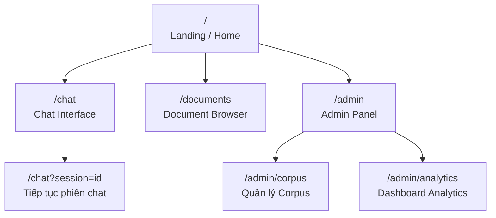

### 1.2 Page Layout Architecture

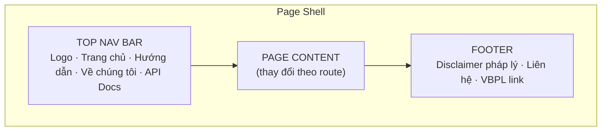

---

## 2. Design System

### 2.1 Color Palette

```
Primary Colors:
  --color-primary:        #1B4F72    ← Xanh navy đậm (trust, authority)
  --color-primary-light:  #2E86C1    ← Xanh navy nhạt
  --color-primary-hover:  #154360    ← Hover state

Accent Colors:
  --color-accent:         #E67E22    ← Cam (highlight, CTA)
  --color-accent-light:   #F39C12    ← Cam nhạt

Semantic Colors:
  --color-success:        #27AE60    ← Xanh lá (answered, positive)
  --color-warning:        #F39C12    ← Vàng (clarification_needed)
  --color-danger:         #E74C3C    ← Đỏ (insufficient_evidence, error)
  --color-info:           #2980B9    ← Xanh info

Neutral Colors:
  --color-bg:             #F8F9FA    ← Background trang
  --color-bg-card:        #FFFFFF    ← Background card
  --color-bg-chat:        #EBF5FB    ← Background chat area
  --color-text-primary:   #1A1A2E    ← Văn bản chính
  --color-text-secondary: #5D6D7E    ← Văn bản phụ
  --color-border:         #D5D8DC    ← Border mặc định

Status Badge Colors:
  answered:               bg #D5F5E3, text #1E8449
  clarification_needed:   bg #FDEBD0, text #A04000
  insufficient_evidence:  bg #FDEDEC, text #922B21
```

### 2.2 Typography

```
Font Family:
  Primary: 'Inter', 'Be Vietnam Pro', sans-serif
  Monospace: 'JetBrains Mono', monospace (cho code, số hiệu văn bản)

Font Scale:
  --text-xs:   0.75rem  / 12px    ← Caption, metadata
  --text-sm:   0.875rem / 14px   ← Secondary text
  --text-base: 1rem     / 16px   ← Body text
  --text-lg:   1.125rem / 18px   ← Subheading
  --text-xl:   1.25rem  / 20px   ← Heading card
  --text-2xl:  1.5rem   / 24px   ← Page heading
  --text-3xl:  1.875rem / 30px   ← Hero heading

Font Weight:
  Regular: 400 | Medium: 500 | Semibold: 600 | Bold: 700
```

### 2.3 Spacing & Layout

```
Base unit: 4px
--space-1: 4px  --space-2: 8px   --space-3: 12px  --space-4: 16px
--space-6: 24px --space-8: 32px  --space-12: 48px

Border Radius: sm=4px  md=8px  lg=12px  xl=16px  full=9999px
Shadows: sm=0 1px 2px rgba(0,0,0,.05)  md=0 4px 6px rgba(0,0,0,.07)
```

---

## 3. Danh sách màn hình

| Screen ID | Tên màn hình | Mô tả | Persona |
|---|---|---|---|
| SCR-01 | Landing Page | Trang giới thiệu, CTA vào chat | Tất cả |
| SCR-02 | Chat Interface | Giao diện hỏi đáp chính | Tất cả |
| SCR-03 | Citation Detail Drawer | Chi tiết trích dẫn văn bản | Tất cả |
| SCR-04 | Filter Panel | Bộ lọc ngày, quận/huyện | Tất cả |
| SCR-05 | Clarification Dialog | Hệ thống hỏi lại người dùng | Tất cả |
| SCR-06 | Document Browser | Danh sách văn bản trong corpus | Luật sư, Cán bộ |
| SCR-07 | Admin Corpus Manager | Quản lý ingest văn bản | Admin |
| SCR-08 | Insufficient Evidence Screen | Không đủ căn cứ pháp lý | Tất cả |

---

## 4. User Flows

### 4.1 Flow 1: Happy Path — Single-hop Query (Người dân)

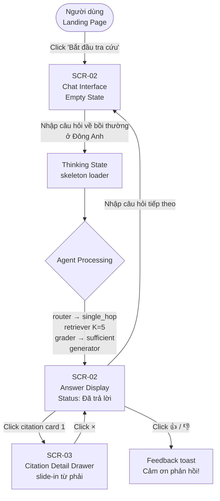

### 4.2 Flow 2: Multi-hop Query (Luật sư)

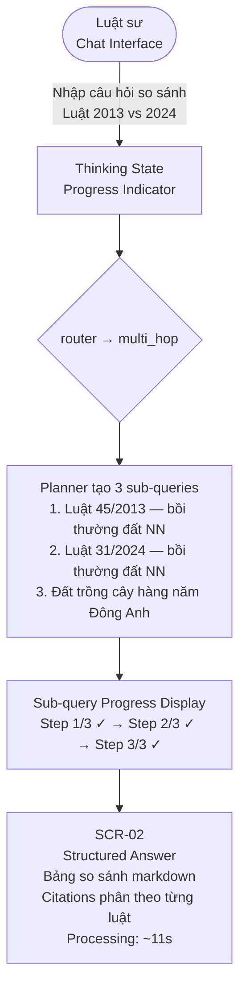

### 4.3 Flow 3: Clarification (Câu hỏi mơ hồ)

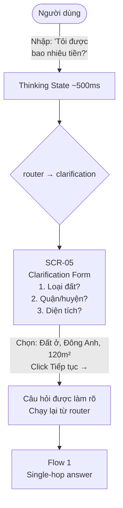

### 4.4 Flow 4: Insufficient Evidence

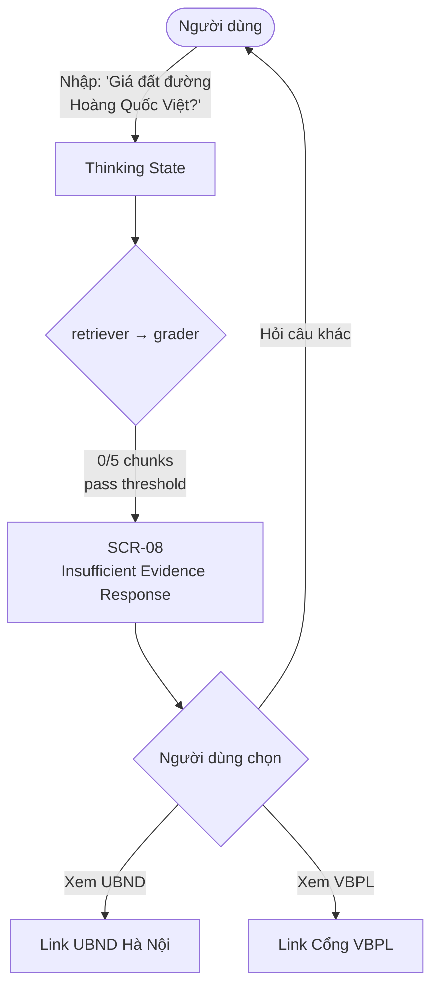

### 4.5 Flow 5: Admin Corpus Ingest

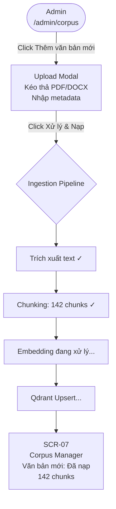

---

## 5. Wireframes chi tiết

> Wireframes dưới đây mô tả layout và component placement. Xem Design System (mục 2) để biết thông số màu sắc, typography, spacing.

### SCR-01: Landing Page

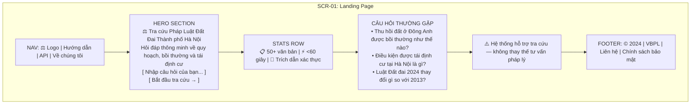

### SCR-02: Chat Interface (Layout)

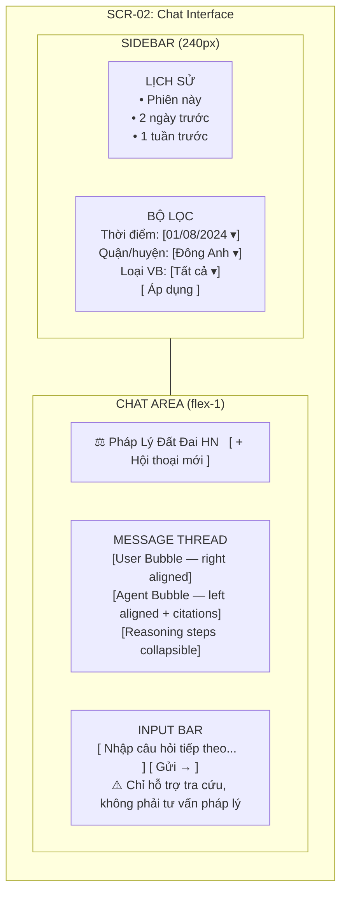

### SCR-02: Agent Answer Bubble (Component Detail)

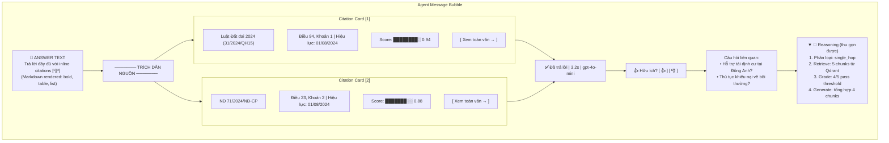

### SCR-03: Citation Detail Drawer

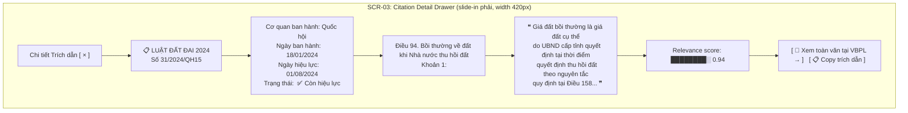

### SCR-02: Thinking / Loading State (Multi-hop)

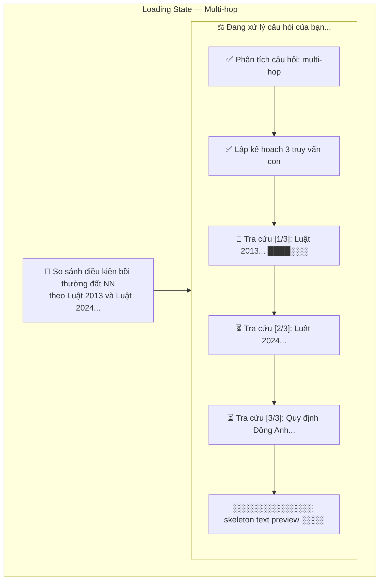

### SCR-07: Admin Corpus Manager

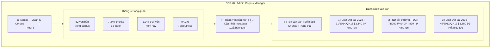

### SCR-05: Clarification Dialog (inline trong chat)

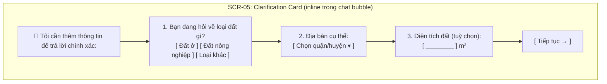

---

## 6. Component Library

### 6.1 Chat Message Components

**UserMessage**
```
Properties:
  - content: string (markdown support)
  - timestamp: Date
  - sessionId: string

Visual:
  - Alignment: right
  - Background: --color-primary (dark blue)
  - Text: white
  - Border radius: 12px 12px 2px 12px (bottom-right square)
  - Max width: 75%
```

**AgentMessage**
```
Properties:
  - content: string (markdown support, table support)
  - status: "answered" | "clarification_needed" | "insufficient_evidence"
  - citations: Citation[]
  - reasoning_steps: string[]
  - route: string
  - processing_time_ms: number
  - timestamp: Date

Visual:
  - Alignment: left
  - Background: white
  - Border: 1px solid --color-border
  - Border radius: 12px 12px 12px 2px (bottom-left square)
  - Max width: 90%
  - Shadow: --shadow-sm
```

**StatusBadge**
```
Variants:
  - answered:               green bg  — "✅ Đã trả lời"
  - clarification_needed:   orange bg — "🤔 Cần làm rõ"
  - insufficient_evidence:  red bg    — "⚠️ Không đủ căn cứ"
  - loading:                gray bg   — animated dots
```

**CitationCard**
```
Properties:
  - index: number (shown as [1], [2]...)
  - document_title: string
  - document_number: string
  - article_ref: string
  - effective_date: Date
  - expiry_date: Date | null
  - source_url: string
  - relevance_score: number (0–1)
  - is_expired: boolean

Visual:
  - Compact card với left border accent color
  - Expired docs: strikethrough + red warning badge
  - Click → opens Citation Detail Drawer
  - Relevance bar: thin progress bar 0–100%
```

### 6.2 Input Components

**QueryInput**
```
Properties:
  - placeholder: "Nhập câu hỏi về pháp luật đất đai..."
  - maxLength: 500
  - onSubmit: (query: string) => void
  - isLoading: boolean
  - suggestions: string[]

Features:
  - Character counter (500 ký tự)
  - Enter → gửi, Shift+Enter → xuống dòng
  - Disabled khi isLoading
  - Auto-resize textarea
```

**FilterPanel**
```
Components:
  - DatePicker: as_of_date (mặc định = hôm nay)
  - DistrictSelect: dropdown 30 quận/huyện HN
  - DocumentTypeCheckboxes: Luật / NĐ / TT / QĐ
  - [ Reset bộ lọc ] button
```

### 6.3 Feedback Component

**FeedbackBar**
```
- Thumbs up: green on hover/active
- Thumbs down: red on hover/active
- After click: show optional comment textarea
- Submit feedback → POST /api/v1/feedback
- Toast: "Cảm ơn phản hồi của bạn!"
```

---

## 7. Responsive & Accessibility

### 7.1 Breakpoints & Layout

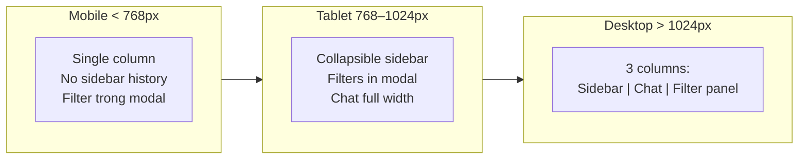

### 7.2 Accessibility (WCAG 2.1 AA)

| Yêu cầu | Triển khai |
|---|---|
| Keyboard navigation | Tab order logic, Enter/Space cho buttons |
| Screen reader | aria-label cho tất cả icon buttons |
| Color contrast | Minimum 4.5:1 cho text, 3:1 cho UI elements |
| Focus indicator | Visible 2px outline trên focused elements |
| Loading state | aria-live="polite" thông báo khi có kết quả |
| Error state | aria-invalid + role="alert" cho error messages |
| Citation links | Descriptive link text (không dùng "click here") |

---

## 8. Interaction States

### 8.1 Query Input States

| State | Visual |
|---|---|
| Default | Border: --color-border, placeholder text |
| Focused | Border: --color-primary, blue glow shadow |
| Loading | Disabled + spinner icon |
| Error | Border: --color-danger, error message below |
| Max length | Counter turns red at 490/500 ký tự |

### 8.2 Agent Response States

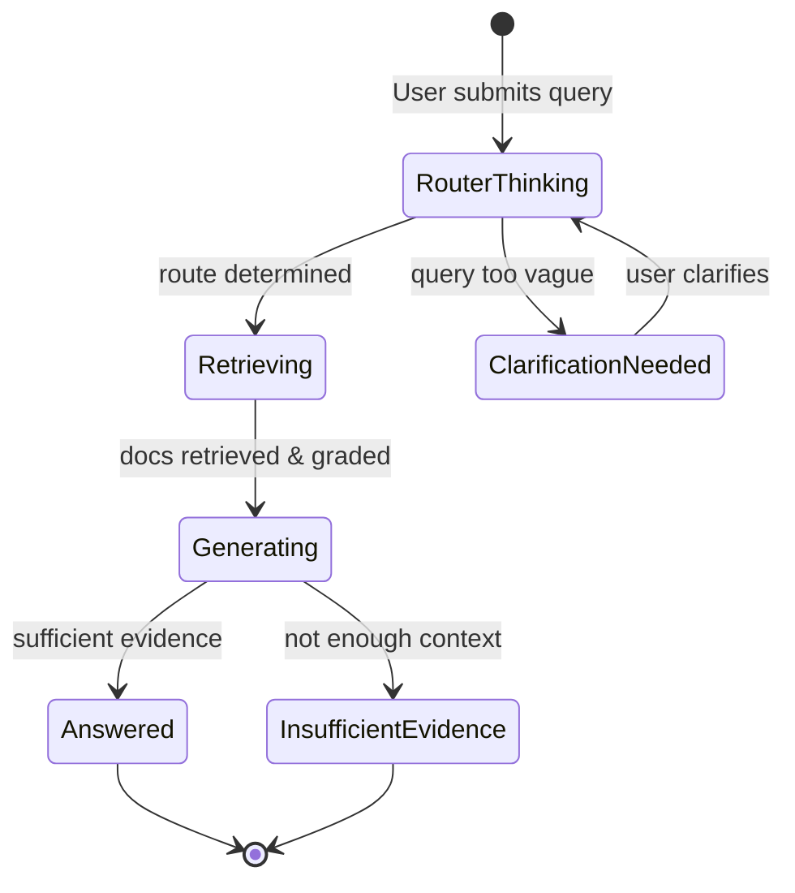

| State | Visual | Duration |
|---|---|---|
| Router thinking | Animated dots "Đang phân tích..." | 0–1s |
| Retrieving | Progress steps visible | 1–5s |
| Generating | Skeleton loader for text | 1–8s |
| Answered | Full response rendered | Final |
| Error | Red error card + retry button | Final |

### 8.3 Micro-animations

| Element | Animation |
|---|---|
| Chat message appear | Fade in + slide up (200ms ease-out) |
| Citation card click | Scale 0.98 → 1.0 (100ms) |
| Drawer slide-in | translateX(100%) → 0 (300ms ease-out) |
| Status badge | Fade in (150ms) |
| Feedback thumbs | Scale pulse (200ms) on click |
| Thinking dots | CSS keyframe bounce, stagger 200ms |

---

## Phụ lục: Mockup Notes

### Thiếu trong Wireframe (để Designer hoàn thiện)
- Logo & brand identity (cần thiết kế chính thức)
- Illustration/icon set phong cách nhất quán
- Dark mode variant
- Error 404 / 500 pages
- Onboarding tour (first visit)

### Design Handoff Checklist
- [ ] Figma file với component library đầy đủ
- [ ] Design tokens export (CSS variables)
- [ ] Interactive prototype cho Flow 1–4
- [ ] Asset export (SVG icons, logo)
- [ ] Spacing & layout specifications

---

*Wireframe & UI Flow v1.1 — Xem PRD.md và Brief.md để biết context đầy đủ.*
