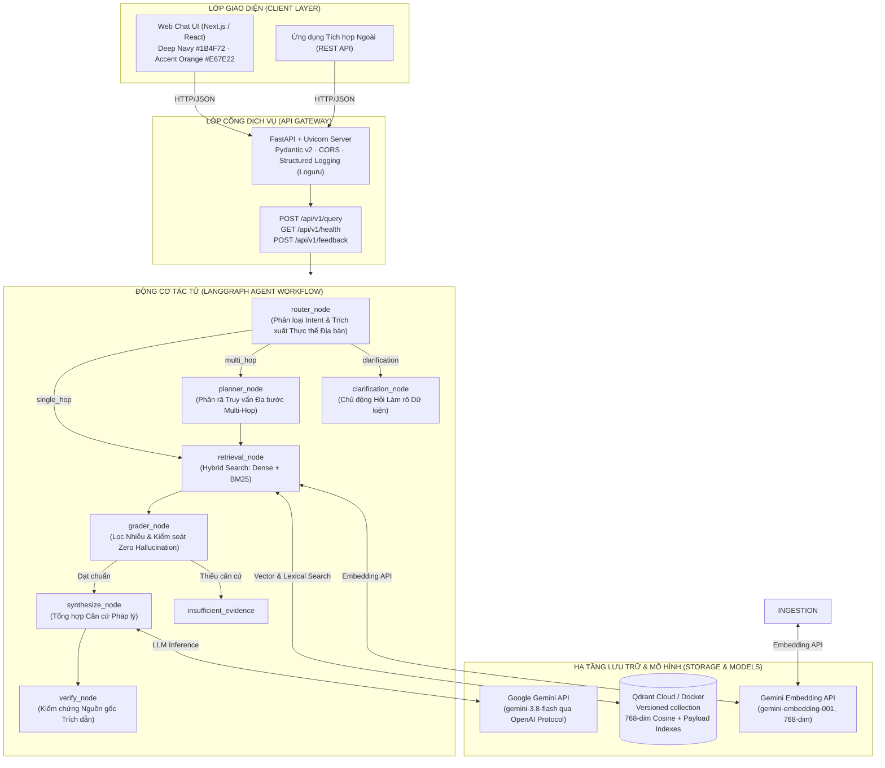
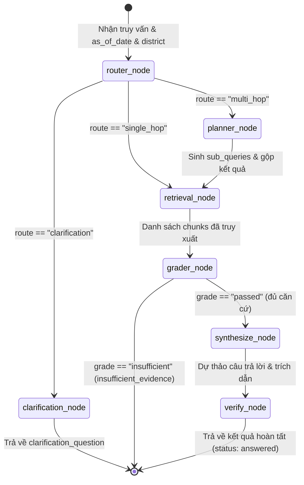
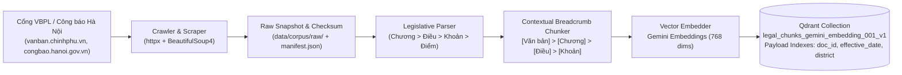

# Architecture Documentation — Agentic RAG Legal QA Hà Nội

> Tài liệu đặc tả kiến trúc kỹ thuật hệ thống Hỏi đáp Pháp luật Đất đai & Quy hoạch TP. Hà Nội.  
> Công nghệ cốt lõi: **LangGraph** · **Google Gemini API (LLM và Embeddings)** · **Qdrant Vector DB** · **FastAPI**

---

## 1. Kiến trúc Tổng thể (High-Level System Architecture)

Hệ thống được thiết kế theo mô hình phân tầng hướng sự kiện và hướng tác tử (Agentic Orchestration), đảm bảo nguyên tắc **Evidence-First** (bằng chứng pháp lý là tối thượng) và **Zero Hallucination Tolerance** (không suy diễn khi thiếu căn cứ):



---

## 2. Luồng Trạng thái Tác tử (LangGraph State Machine)

Hệ thống quản trị trạng thái tập trung thông qua `LegalAgentState` kế thừa từ TypedDict:



### Chi tiết các Node xử lý:
1. **`router_node`**:
   - Trích xuất thực thể 30 quận/huyện/thị xã của Hà Nội từ câu hỏi.
   - Chuẩn hóa mốc thời gian áp dụng luật `as_of_date` (mặc định là ngày truy vấn nếu không có chỉ định).
   - Phân loại intent: câu hỏi một bước (`single_hop`), câu hỏi so sánh đa chiều (`multi_hop`), hoặc câu hỏi mơ hồ thiếu dữ kiện (`clarification`).
2. **`planner_node`**:
   - Phân rã câu hỏi so sánh/đa bước thành 2-3 câu hỏi con nguyên tử (sub-queries) để truy xuất toàn diện các khía cạnh pháp luật.
3. **`retrieval_node`**:
   - Gọi `HybridRetriever` thực thi dense retrieval (Gemini Embeddings) cùng lexical topic fallback và payload filters trên Qdrant.
   - Lọc metadata theo mốc hiệu lực thời gian `as_of_date` và địa bàn hành chính.
4. **`grader_node`**:
   - Rà soát độ liên quan ngữ nghĩa và trường từ vựng pháp lý của các đoạn trích.
   - Kích hoạt quy tắc **Chặn phỏng đoán**: Nếu câu hỏi nằm ngoài phạm vi pháp luật đất đai hoặc không có văn bản liên quan, lập tức trả về `status: "insufficient_evidence"`.
5. **`synthesize_node`**:
   - Gửi prompt có định dạng cấu trúc sang mô hình Google Gemini (`gemini-3.8-flash` qua OpenAI protocol) để tổng hợp câu trả lời khách quan, chuẩn xác.
   - Tích hợp bộ đệm deterministic fallback khi gặp giới hạn hạn mức (Rate limit/Quota 429) của gói Free Tier.
6. **`verify_node`**:
   - Kiểm tra chéo từng trích dẫn (`citations`) với cơ sở dữ liệu `manifest.json` và nguồn gốc văn bản ban hành.
   - Gắn đường link nguồn chính thức từ Cổng TTĐT Chính phủ (`vanban.chinhphu.vn`) hoặc Công báo TP. Hà Nội (`congbao.hanoi.gov.vn`).
7. **`clarification_node`**:
   - Tạo câu hỏi phản hồi định hướng thân thiện khi câu hỏi của người dùng còn thiếu dữ kiện quan trọng (như loại đất nông nghiệp/đất ở, vị trí quận/huyện).

---

## 3. Đường ống Thu thập & Xử lý Dữ liệu (Ingestion Pipeline)



### Đặc điểm nổi bật của Chunking:
- **Bảo toàn Cấu trúc Pháp lý**: Không cắt chunk theo độ dài token cơ học ngẫu nhiên. Mỗi chunk tương ứng với 1 Khoản hoặc 1 Điều trọn vẹn kèm ngữ cảnh Chương và Tên văn bản.
- **Tiêm ngữ cảnh (Breadcrumb Context Injection)**: Mọi chunk đều được gắn tiền tố:
  ```text
  [Văn bản: Luật Đất đai số 31/2024/QH15] > [Chương VII: Bồi thường, hỗ trợ, tái định cư khi Nhà nước thu hồi đất] > [Điều 94: Bồi thường về đất khi Nhà nước thu hồi đất ở] > [Khoản 1]
  ```
  Nhờ đó, mô hình Embedding và LLM luôn nắm rõ phạm vi áp dụng của từng điều khoản kể cả khi điều khoản đó chỉ có vài dòng chữ.

---

## 4. Chiến lược Tìm kiếm Lai (Hybrid Retrieval Strategy)

- **Dense Semantic Retrieval**: Sử dụng `gemini-embedding-001` sinh vector 768 chiều, tính khoảng cách Cosine Distance. Ingestion dùng `RETRIEVAL_DOCUMENT`, truy vấn dùng `RETRIEVAL_QUERY`; xem [ADR-0005](../adr/0005-gemini-embedding.md) về quota, dữ liệu gửi tới dịch vụ ngoài và migration collection.
- **Sparse / Lexical Matching**: Bắt chính xác số hiệu văn bản (`31/2024/QH15`, `61/2024/QĐ-UBND`) và mã điều khoản (`Điều 94`, `Khoản 2`).
- **Qdrant Payload Filtering**: Áp dụng bộ lọc ràng buộc trước (pre-filtering):
  - `effective_date <= as_of_date`: Văn bản đã có hiệu lực tại thời điểm tra cứu.
  - `expiry_date == null OR expiry_date >= as_of_date`: Văn bản chưa hết hiệu lực.
  - `administrative_area IN ["Toàn quốc", "Hà Nội", district]`: Văn bản áp dụng cho địa bàn Hà Nội.

---

## 5. Danh mục Văn bản Pháp lý Hạt nhân (Corpus P0 — Đã Lập chỉ mục)

Toàn bộ 81 chunks đã được lập chỉ mục và kiểm thử trên Qdrant Cloud:
1. **Luật Đất đai số 31/2024/QH15** (Ban hành: 18/01/2024, Hiệu lực: 01/08/2024).
2. **Nghị định số 88/2024/NĐ-CP** (Bồi thường, hỗ trợ, tái định cư khi Nhà nước thu hồi đất).
3. **Nghị định số 102/2024/NĐ-CP** (Quy định chi tiết thi hành một số điều của Luật Đất đai).
4. **Quyết định số 61/2024/QĐ-UBND TP. Hà Nội** (Quy định cụ thể bồi thường, hỗ trợ, tái định cư trên địa bàn TP. Hà Nội).
5. **Nghị quyết số 52/2025/NQ-HĐND TP. Hà Nội** (Ban hành Bảng giá đất áp dụng trên địa bàn TP. Hà Nội).
